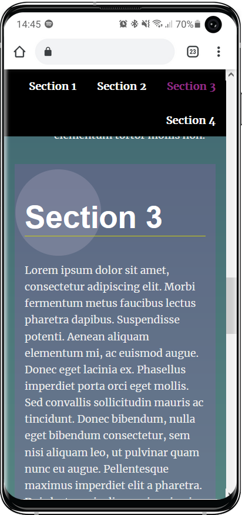

# Landing Page Project

## Instructions

### The first project of the FWD Udacity front end development

### most of the modifications in the code are made in `js/app.js` file and slight modification in the index.html file.

## Description

- A landing page, fully functional navigation bar built by javascript code only.

- smooth scrolling among the section when any linke is clicked. 

- the nav bar is dynamically build based on the number of section determined on the html file.

- the modifications were to append a fourth section to the page, some changes in the css file (optional), adding functionality for the page via js code.

- the code in the `js/app.js` file isn't necessarely in the same order as was asked in the file comments, and some of the functions don't fit that order.

## sources used in the project, credits
- https://developer.mozilla.org/en-US/docs/Glossary/Viewport
- https://developer.mozilla.org/en-US/docs/Web/API/Element/getBoundingClientRect
- https://developer.mozilla.org/en-US/docs/Web/API/EventTarget/addEventListener

### Author's name 
#### Ali Badawi.

